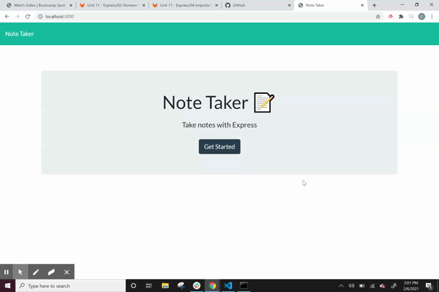

# Note_Taker

## Mock-Up

The following gif shows the functionality of this application. This application allows the user to write, save, and delete notes. It uses an express backend that saves and retrieves note data from a JSON file.

## Installation
Link to website:
[Web App Link](https://blooming-fjord-87057.herokuapp.com/)
